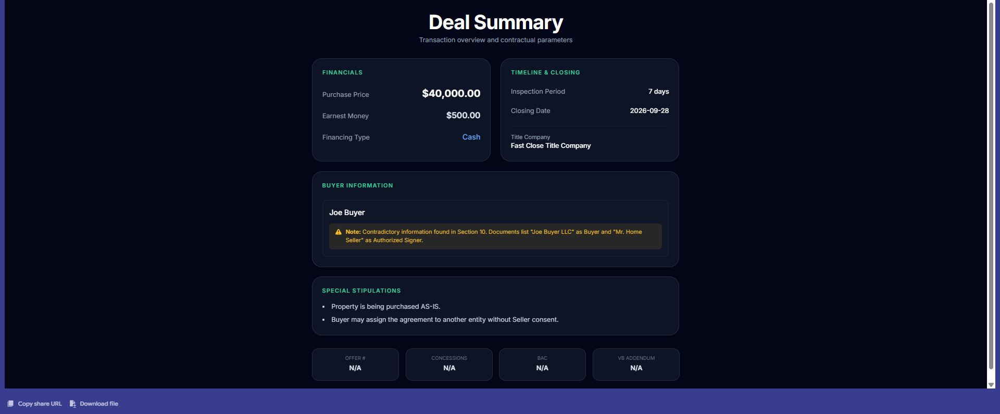
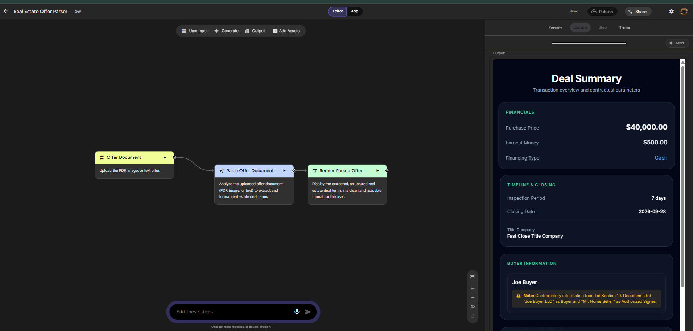
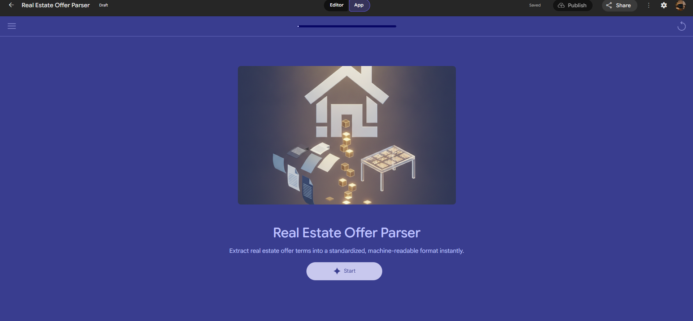

# 🏡 Real Estate Offer Parser

An AI-powered real estate workflow built with **Google Gemini Opal** to extract key terms from residential purchase agreements and convert them into a standardized deal summary.



## Overview

The Real Estate Offer Parser was created to streamline the review of purchase agreements by turning unstructured contract information into structured, easy-to-review deal terms.

The project combines **real estate domain knowledge, generative AI, data structuring, and workflow automation**.

## Features

* 📄 Analyze purchase agreement documents
* 💰 Extract purchase price and earnest money
* 🏦 Identify financing type and deadline
* 📅 Extract inspection period and closing date
* 🏢 Identify title/closing company
* 🤝 Extract buyer agent compensation (BAC)
* 💵 Identify seller concessions
* 📝 Summarize special stipulations
* 📎 Detect VB Addendum references
* ⚠️ Flag potential contradictions
* 📊 Present results in a standardized deal summary

## Workflow

```text
Purchase Agreement
        ↓
Gemini Opal
        ↓
Document Analysis
        ↓
Offer Term Extraction
        ↓
Validation / Contradiction Detection
        ↓
Standardized Deal Summary
```
## 📸 Project Preview

### Application


### Opal Workflow



### Landing Page




## Limitations

* Extraction accuracy depends on document quality and formatting.
* Scanned or handwritten documents may produce less reliable results.
* The parser does not provide legal advice or determine contractual enforceability.
* Missing or ambiguous information may be returned as `N/A`.
* This is currently a prototype rather than a production transaction-management system.

## Future Improvements

* Offer history and database storage
* Multiple-offer comparison
* Excel/CSV export
* Improved OCR support
* Page-level source references
* Offer pipeline tracking
* Automated email-to-parser workflow
* Acquisition analytics dashboard
* API integration with real estate systems

## Technology

**Google Gemini Opal · Generative AI · Real Estate · Data Analytics · Workflow Automation**

> **Project Status:** 🚧 Prototype / Active Development
> ## 👩🏽‍💻 Author

**LaQuita Jordan**

Real Estate Agent | Data Analytics Graduate Student | AI & Automation Enthusiast

I’m interested in the intersection of **real estate, data analytics, AI, and workflow automation**, with a focus on using technology to solve practical business problems.

- GitHub: [@lajordan09](https://github.com/lajordan09)
- LinkedIn:[LaQuita Jordan](https://www.linkedin.com/in/laquitajordan-memphis/)

---

> **Project Status:** 🚧 Prototype / Active Development
